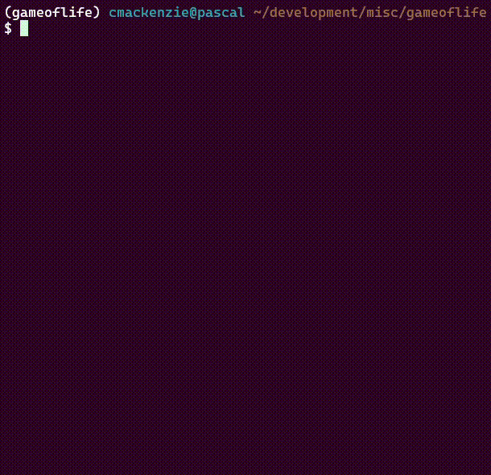

# Conway's Game of Life

This is an interactive implementation of Conway's Game of Life using `Pygame`, `Scipy` and `NumPy`!  

Use the mouse to draw, pause and clear the slide! (Left, Middle and Right click respectively)

Edit the variables in the `options.ini` file to change the size/resolution of the board and the visualisation.



## Description

The Game of Life is a demonstation of cellular automata, where generations of cells are simulated based upon the previous generation. These cells populate our board and are either alive (1), or dead (0). The next generation is formed from the following rules:

    1. Any live cell with fewer than two live neighbors dies, as if by underpopulation.
    2. Any live cell with two or three live neighbors lives on to the next generation.
    3. Any live cell with more than three live neighbors dies, as if by overpopulation.
    4. Any dead cell with exactly three live neighbors becomes a live cell, as if by reproduction.

These simple rules can result in very interesting behaviours!

## How To Install

You may use the follow commands to navigate to the cloned repository, install the required dependencies, activate the new environment and launch the program:

```
cd PATH/TO/GAMEOFLIFE
```

```
conda install --name YOUR-ENV-NAME --file environment.yml  
```

```
conda activate YOUR-ENV-NAME   
```

```
./gameoflife.py   
```
